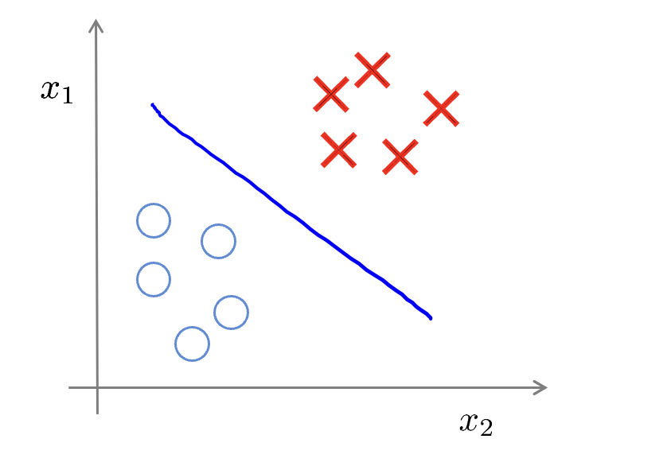

# Maching Learning

## 十三、聚类(Clustering)
### 13.1 无监督学习
简单的来说，在通常情况下现实生活里面是没有太多已知的东西，换成ML语言来说就是样本集并不携带标签Lable。

对于监督学习来说，样本集是一个非常标准的已知输入输出，带标签。

直观上来说的就是从

### 13.2 K-Means(K-均值算法)
**K-Means**是一个迭代算法，假设我们想要将数据聚类成K个组，其方法为:

1. **初始化的过程：** 首先选择个**随机**的点，称为**聚类中心**（cluster centroids）；
2. **分类**： 每一个数据样本点都计算和聚类中心点的“距离（权重）”，找出相对于当前样本点，最优的这个聚类中心。比如这里评价指标为最短距离 $c^{(i)} = minmize || x^{(i)} - \mu_k||$
3. **更新聚类中心：** 计算每一个类的平均值，将该类所关联的中心点移动到平均值的位置。

重复步骤2-3直至中心点和分类结果不再变化。

初始化的过程

 
分类

 

 

