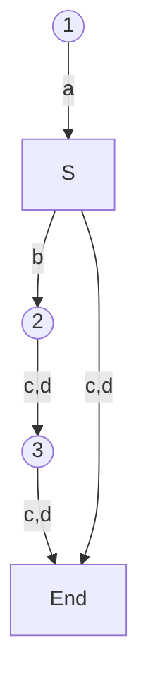

# 一级标题

## 二级标题

### 三级标题

$$
\begin{equation}\label{eq1}
e=mc^2
\end{equation}
$$

著名的质能方程 $\eqref{eq1}$ 由爱因斯坦提出 ...

## NEW1

408

第一轮不用看教材

1. casapp 第一章 第二章 cash 
2. 袁春风 计算机系统基础
3. 计算机组成和系统结构 袁春风
4. 计算机网络 谢 （字典）
5. 操作系统 慕课 汤

胡科大

王道强化课

模拟题

只推荐选择题

利用考纲

$a_n = \frac{n^2}{n+1}$

要将二次型 $2x_2^2 + 2x_1x_3$ 化为规范型，需要进行以下三个步骤：

1. 将二次型的系数矩阵 $A$ 对角化，得到对角矩阵 $\Lambda$ 和正交矩阵 $P$，使得 $A = P\Lambda P^T$。

2. 进行变量代换 $x = Py$。

3. 将二次型化为规范型，即 $q(y) = y_1^2 + y_2^2 + \cdots + y_r^2$，其中 $r$ 是二次型的秩。

首先，计算二次型的系数矩阵：

$$
A =
\begin{pmatrix}
0 & 1 & 0 \\
1 & 0 & 0 \\
0 & 0 & 0 \\
\end{pmatrix}
$$

对系数矩阵进行特征值分解，得到：

$$
\begin{aligned}
\det(\lambda I - A) &= \begin{vmatrix} \lambda & -1 & 0 \\ -1 & \lambda & 0 \\ 0 & 0 & \lambda \end{vmatrix} \\
&= \lambda^3 - \lambda = \lambda(\lambda - 1)(\lambda + 1)
\end{aligned}
$$

因此，特征值为 $\lambda_1 = -1, \lambda_2 = 0, \lambda_3 = 1$。对应的特征向量分别为：

$$
\begin{aligned}
\lambda_1 = -1: && \begin{pmatrix} 0 \\ 1 \\ 0 \end{pmatrix} \\
\lambda_2 = 0: && \begin{pmatrix} 1 \\ 0 \\ 0 \end{pmatrix} \\
\lambda_3 = 1: && \begin{pmatrix} 0 \\ 0 \\ 1 \end{pmatrix}
\end{aligned}
$$

将特征向量组成正交矩阵 $P$：

$$
P =
\begin{pmatrix}
0 & 1 & 0 \\
1 & 0 & 0 \\
0 & 0 & 1 \\
\end{pmatrix}
$$

则 $A$ 可对角化为：

$$
\Lambda = P^T A P =
\begin{pmatrix}
-1 & 0 & 0 \\
0 & 0 & 0 \\
0 & 0 & 1 \\
\end{pmatrix}
$$

进行变量代换 $x = Py$，得到：

$$
\begin{pmatrix}
x_1 \\ x_2 \\ x_3
\end{pmatrix} =
\begin{pmatrix}
0 & 1 & 0 \\
1 & 0 & 0 \\
0 & 0 & 1 \\
\end{pmatrix}
\begin{pmatrix}
y_1 \\ y_2 \\ y_3
\end{pmatrix} =
\begin{pmatrix}
y_2 \\ y_1 \\ y_3
\end{pmatrix}
$$

将二次型 $2x_2^2 + 2x_1x_3$ 用 $y$ 表示为：

$$
\begin{aligned}
2x_2^2 + 2x_1x_3 &= 2y_1^2 + 2y_2y_3 \\
&= 2(y_1^2 + y_2y_3)
\end{aligned}
$$

因此，二次型化为规范型：

$$
q(y) = y_1^2 + y_2y_3
$$

其中，$r=2$ 是二次型的秩。

GM_addStyle(`
  .g-sd1 {
    display: none !important;
  }
  .g-mn1c {
    margin-left: 0px !important;
  }
  .m-learnhead{
    display: none !important;
  }
`);

